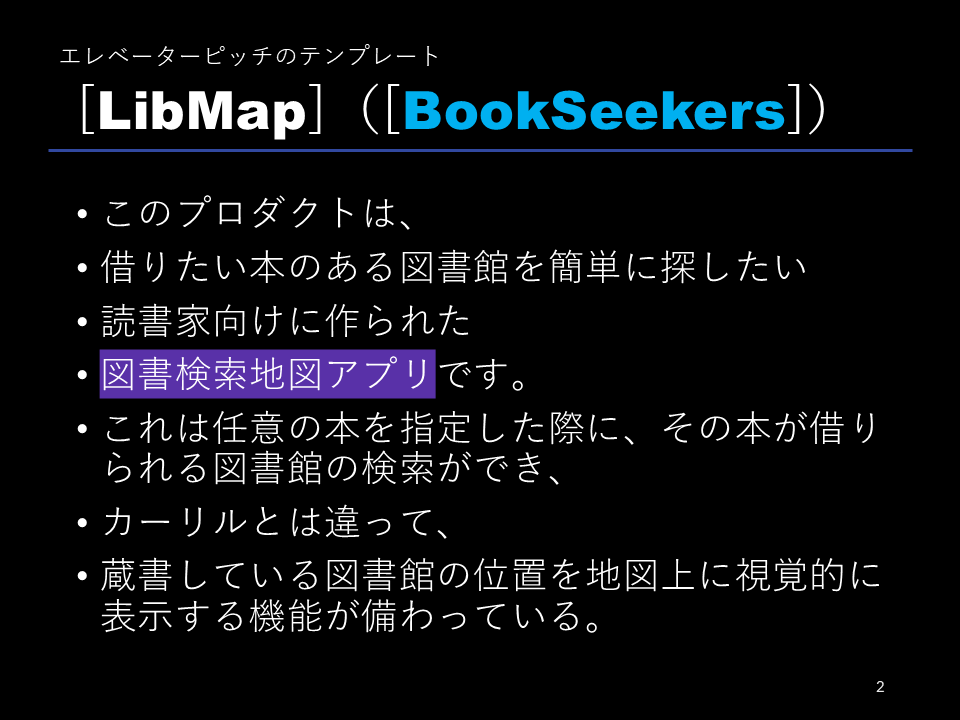
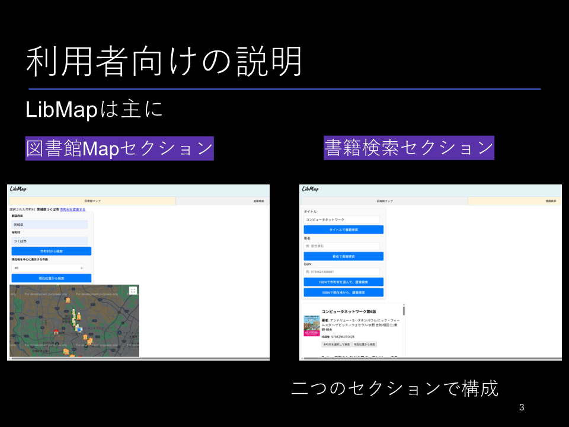
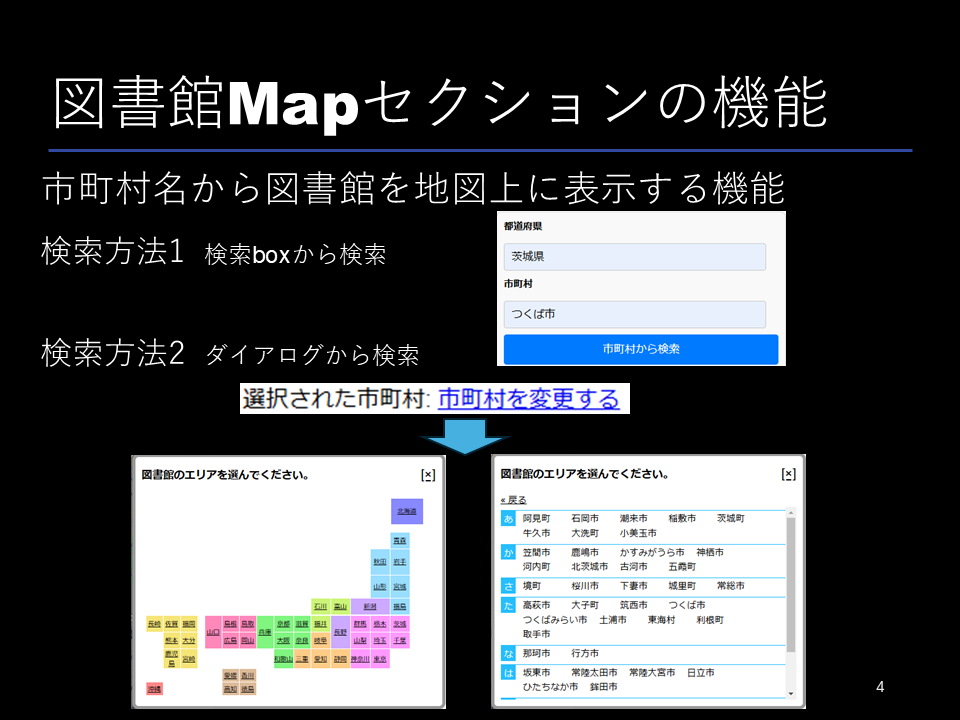
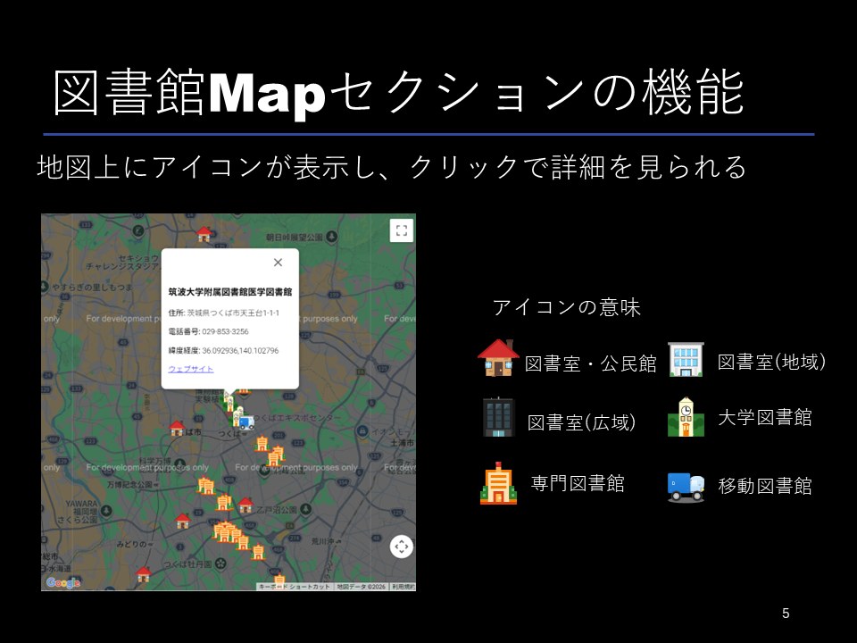
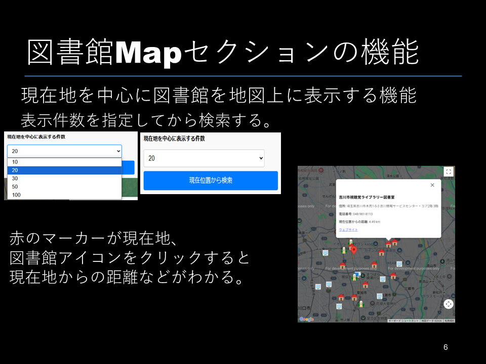
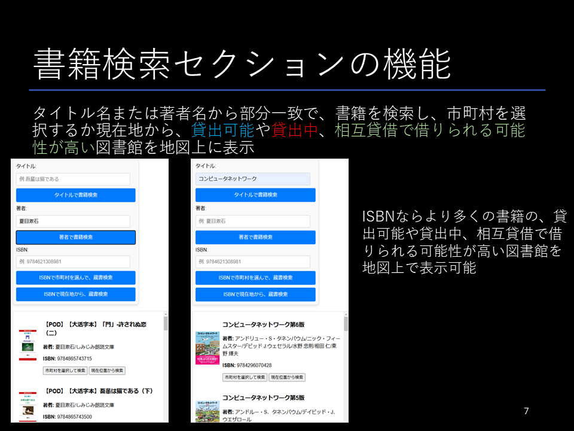
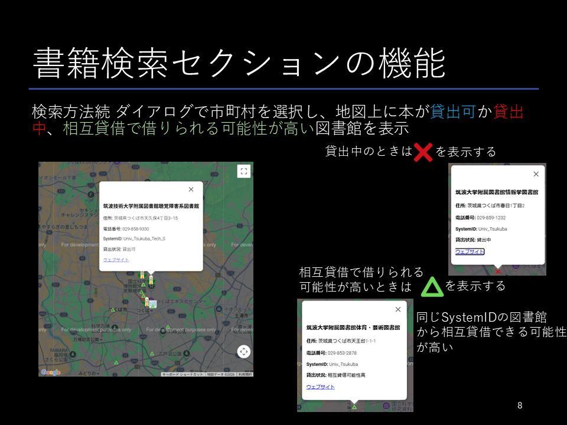
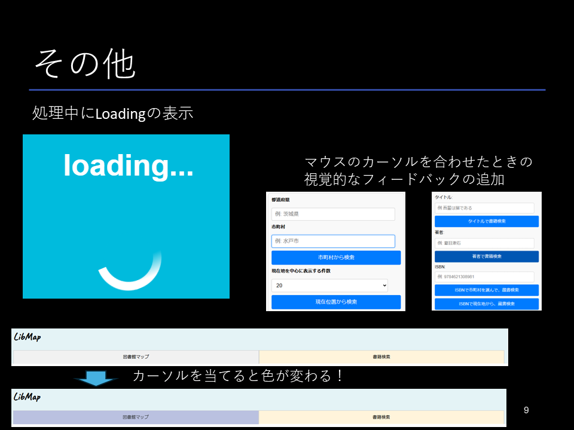

# LibMap - 図書館・蔵書検索マップアプリ

楽天ブックスAPIで書籍を検索し、カーリルAPIを利用して「指定した市町村」や「現在地周辺」の図書館での貸出状況をGoogleマップ上に可視化するシングルページアプリケーション（SPA）です。

## 🌟 主な機能

* **図書館マップ検索**
  * 指定した都道府県・市町村にある図書館をマップ上にマッピングします。
  * Geolocation APIを利用し、現在地周辺の図書館を近い順に検索・表示します。
* **書籍・蔵書検索**
  * タイトルや著者名から書籍（ISBN）を検索します（楽天ブックスAPI）。
  * 選択した書籍が、周辺の図書館で「貸出可」「貸出中」など、どのようなステータスであるかをマップ上のピンの色・形で視覚的に表示します。

## 🛠 使用技術

* **フロントエンド**: HTML5, CSS3, JavaScript (Vanilla JS / ES6+)
* **利用API**:
  * [Google Maps JavaScript API](https://developers.google.com/maps/documentation/javascript) (地図描画)
  * [カーリルAPI](https://calil.jp/doc/api_ref.html) (図書館検索・蔵書検索・JSONPポーリング処理)
  * [楽天ブックスAPI](https://webservice.rakuten.co.jp/) (書籍メタデータ取得)
* **ライブラリ**: jQuery (一部のUI制御用)

## 💡 開発における工夫点・アピールポイント

1. **複雑な非同期処理（ポーリング）の実装**
   カーリルAPIの蔵書検索はバックグラウンドで処理されるため、一度のリクエストでは完了しません。`continue`フラグを監視し、結果が揃うまで再帰的にリクエストを送るポーリング処理をVanilla JSで実装しました。
2. **状態管理（State Management）の整理**
   アプリ全体の状態（検索モード、選択中のISBN、現在地座標など）を `appState` オブジェクトに集約し、グローバル変数の散乱を防ぎ、保守性の高いコードを意識しました。
3. **セキュリティへの配慮**
   GitHubなどのパブリックリポジトリに認証情報が漏洩しないよう、APIキーはハードコードせず、利用者が手元で入力する設計にしています。

## 🚀 ローカルでの動かし方（セットアップ）

セキュリティの観点から、本リポジトリのコードにはAPIキーを含めていません。手元で動作確認を行う場合は、以下の手順でご自身のAPIキーを設定してください。

1. 本リポジトリをクローン、またはZIPでダウンロードします。
   ```bash
   git clone [https://github.com/あなたのユーザー名/リポジトリ名.git](https://github.com/あなたのユーザー名/リポジトリ名.git)

2. 以下のサービスから各種APIキーを取得します。

   * [Google Cloud Console](https://console.cloud.google.com/) (Google Maps API Key)
   * [カーリル デベロッパー登録](https://calil.jp/api/dashboard/) (App Key)
   * [楽天ウェブサービス](https://webservice.rakuten.co.jp/) (Application ID)

3. `index.html` をテキストエディタで開き、以下の箇所を取得したキーに書き換えます。

   * **7行目付近:** `<script src="...&key=YOUR_GOOGLE_MAPS_API_KEY"></script>`
   * **176行目付近 (`API_CONFIG`):** `CALIL_KEY` および `RAKUTEN_ID`

4. 修正を保存し、`libmap.html` をブラウザで開くとアプリが起動します。

## 📊 プロダクト紹介スライド（ピッチ資料）

アプリのコンセプトや実際の画面イメージです。


<br>

<br>

<br>

<br>

<br>

<br>

<br>

<br>


## 📄 ライセンス

This project is licensed under the MIT License - see the [LICENSE](LICENSE) file for details.
 ***
## Kosuzuki2025 の設計担当箇所
* Google Maps APIを用いた地図描画および各種マーカーの配置処理
* 各種マーカーのSVG画像の作成
* Geolocation APIを活用した現在地取得と周辺検索機能
* 緯度・経度を用いた2点間の直線距離算出アルゴリズムの実装
* 図書館の種類に応じたSVGアイコンの出し分けと情報ウィンドウ（吹き出し）の実装
* 楽天ブックスAPIを用いた書籍のタイトル・著者検索の基盤実装


**工夫した点**\
ユーザが直感的に地図を操作できるよう、Google Maps API周りの実装とUI/UXの向上に注力しました。
検索結果として複数の図書館データが返ってきた際、画面外に図書館が配置されてしまうのを防ぐため、取得した緯度・経度の配列から中央値（Median Center）を計算し、自動的に地図の中心座標を最適化するアルゴリズム（`calculateMedianCenter`）を実装しました。
また、Geolocation APIを用いてユーザの現在地を取得するだけでなく、球面三角法を用いた距離計算式（`calculateDistance`）を自作し、各図書館までの直線距離をキロメートル単位で算出して情報ウィンドウに表示させることで、実用性の高いマップアプリに仕上げました。

**困難だったポイント**\
非同期で取得したデータ（図書館の位置情報など）を、タイミング良くGoogleマップ上に反映させるライフサイクルの管理に苦労しました。特に、前の検索結果のマーカーを正しく消去（クリア）してから新しいピンを立てる処理や、現在地検索と市町村検索で状態を切り替えるロジックの構築において、JavaScriptの変数のスコープや状態管理の難しさを実感しました。
また、図書館の規模や貸出ステータスに応じて多数のカスタムアイコン（SVG等）を動的に切り替えて表示させる処理も複雑でしたが、連想配列を活用することで可読性を保ちながら実装することができました。
